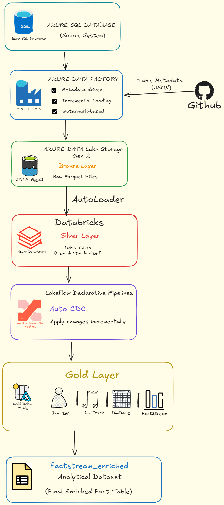
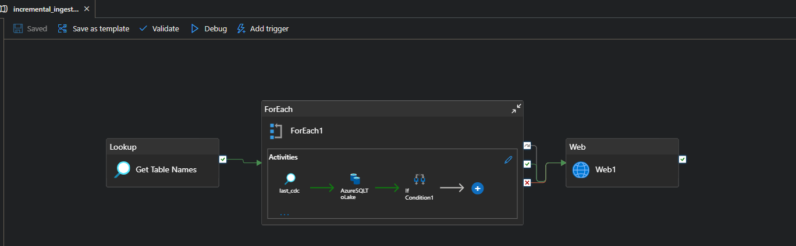
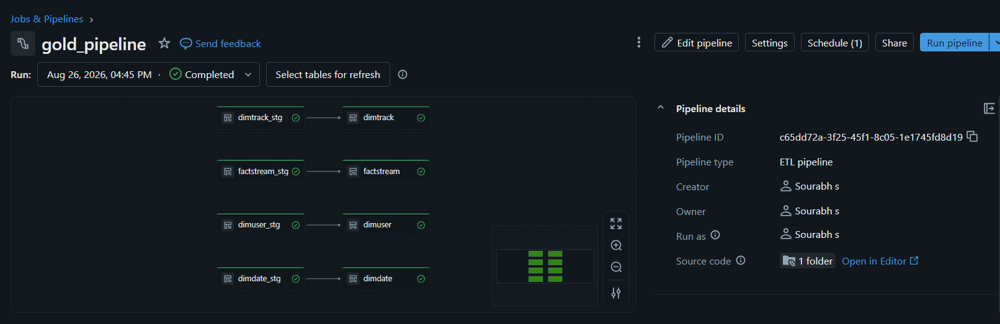
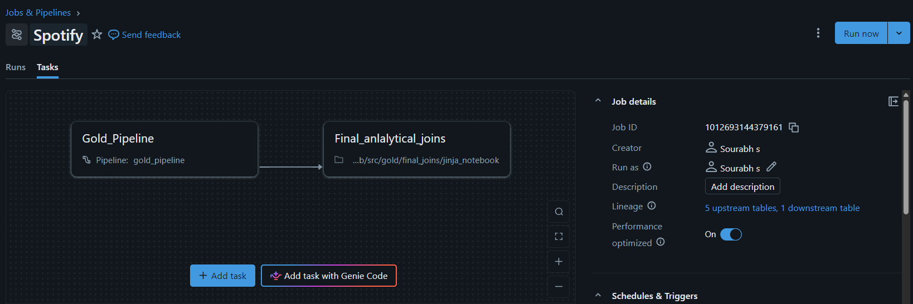
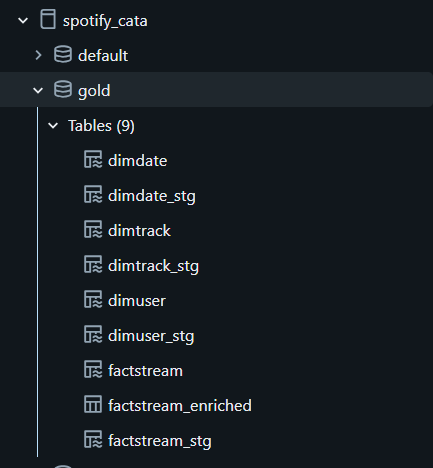

# Spotify Data Engineering Pipeline

An end-to-end data engineering project built using Azure Data Factory, Azure Data Lake Storage Gen2, and Databricks.

The project implements a metadata-driven incremental ingestion pipeline that extracts data from Azure SQL Database, stores raw data in ADLS Gen2, processes it using Databricks, and produces analytical datasets using Lakeflow Declarative Pipelines.

---

## Architecture



https://excalidraw.com/#json=xiDs2txvWzvk0IJnm_jFf,BlEWGg6HHI3xfi1GtAEPDA

---

## Project Overview

This project demonstrates an end-to-end data pipeline following a Bronze, Silver, and Gold architecture.

The pipeline performs:

- Metadata-driven ingestion using Azure Data Factory
- Watermark-based incremental loading
- Storage of raw data as Parquet files in ADLS Gen2
- Incremental file ingestion using Databricks Auto Loader
- Processing and standardization using Databricks
- Creation of analytical dimension and fact tables using Lakeflow Declarative Pipelines
- Incremental change processing using Auto CDC
- Final analytical joins using Spark SQL and Jinja templating

---

## Data Pipeline Flow

```text
Azure SQL Database
        ↓
Azure Data Factory
Metadata-driven Incremental Ingestion
        ↓
ADLS Gen2 - Bronze Layer
Raw Parquet Files
        ↓
Databricks Auto Loader
        ↓
Silver Layer
Delta Tables
        ↓
Lakeflow Declarative Pipelines
Auto CDC
        ↓
Gold Layer
Dimension and Fact Tables
        ↓
Final Analytical Joins
        ↓
factstream_enriched
```

---

## Technologies Used

| Technology | Purpose |
|---|---|
| Azure SQL Database | Source system |
| Azure Data Factory | Metadata-driven incremental ingestion |
| Azure Data Lake Storage Gen2 | Bronze layer storage |
| Azure Databricks | Data processing and transformation |
| Apache Spark | Distributed data processing |
| Delta Lake | Delta table storage |
| Databricks Auto Loader | Incremental file ingestion |
| Lakeflow Declarative Pipelines | Incremental pipeline processing |
| Auto CDC | Incremental change processing |
| Databricks Asset Bundles | Deployment and resource configuration |
| Jinja | Dynamic SQL generation |
| GitHub | Version control and table metadata |

---

# Azure Data Factory: Metadata-Driven Incremental Ingestion

Azure Data Factory orchestrates the ingestion process using a metadata-driven approach.

The pipeline retrieves table metadata, iterates through the configured tables, and performs incremental ingestion using watermark-based logic.



### Key Implementation Details

- Metadata-driven table processing
- Dynamic `ForEach` iteration
- Watermark-based incremental loading
- Azure SQL as the source system
- Dynamic source and sink handling
- Raw data stored in ADLS Gen2 as Parquet files

---

# Bronze Layer

The Bronze layer acts as the raw landing zone for the data extracted from Azure SQL Database.

Azure Data Factory writes the ingested data to Azure Data Lake Storage Gen2 as Parquet files.

```text
Azure SQL Database
        ↓
Azure Data Factory
        ↓
ADLS Gen2 Bronze Layer
        ↓
Raw Parquet Files
```

---

# Silver Layer

Databricks processes the raw files from the Bronze layer and creates standardized Silver Delta tables.

Databricks Auto Loader is used to incrementally discover and process new files arriving in the Bronze layer.

### Silver Layer Processing

- Incremental file discovery using Auto Loader
- Processing of Bronze Parquet files
- Data transformation and standardization
- Storage as Delta tables

---

# Lakeflow Declarative Pipeline

Lakeflow Declarative Pipelines process the staged data and create the Gold layer tables.

The pipeline processes staging tables and produces analytical dimension and fact tables.



### Gold Layer Tables

- `dimuser`
- `dimtrack`
- `dimdate`
- `factstream`

---

# Auto CDC and Incremental Processing

The Gold layer uses Auto CDC to apply changes incrementally from the staging layer to the target tables.

Different tables can use different change-handling strategies depending on the analytical requirements.

This allows the pipeline to process changes incrementally instead of rebuilding the entire analytical layer for every update.

---

# Databricks Job Orchestration

A Databricks workflow orchestrates the execution of the Gold pipeline and the final analytical transformation.



The workflow executes the following dependency:

```text
Gold_Pipeline
      ↓
Final_analytical_joins
```

This ensures that the final analytical joins execute only after the Gold pipeline has completed successfully.

---

# Final Analytical Processing

After the Gold tables are created, the dimension and fact tables are joined to create an enriched analytical dataset.

Jinja is used to dynamically generate the Spark SQL used for the analytical joins.

The final output is:

```text
factstream_enriched
```

---

# Gold Layer Data Model

The Gold layer contains analytical dimension tables, a fact table, and the final enriched dataset.



### Dimension Tables

- `dimuser`
- `dimtrack`
- `dimdate`

### Fact Table

- `factstream`

### Final Analytical Dataset

- `factstream_enriched`

---

# Project Structure

```text
azureproject/
│
├── dataset/                 # Azure Data Factory datasets
├── factory/                 # Azure Data Factory configuration
├── linkedService/           # Azure service connections
├── pipeline/                # ADF pipelines
│
├── databricks/
│   └── spotify_dab/         # Databricks Asset Bundle
│       ├── resources/       # Pipeline and job configurations
│       ├── src/             # Silver and Gold transformations
│       └── databricks.yml   # Bundle configuration
│
├── docs/
│   └── images/
│       ├── architecture.png
│       ├── adf-pipeline.png
│       ├── gold-pipeline.png
│       ├── databricks-job.png
│       └── gold-tables.png
│
└── README.md
```

---

# Key Concepts Demonstrated

- Metadata-driven data pipelines
- Incremental data ingestion
- Watermark-based processing
- Bronze, Silver, and Gold architecture
- Apache Spark
- Delta Lake
- Databricks Auto Loader
- Lakeflow Declarative Pipelines
- Auto CDC
- Dimension and fact table modeling
- Dynamic SQL generation using Jinja
- Databricks Job orchestration
- Databricks Asset Bundles
- End-to-end Azure data engineering

---

# Project Highlights

This project demonstrates how different incremental processing techniques can be used across different layers of a modern data platform:

| Layer | Technology | Incremental Strategy |
|---|---|---|
| Source to Bronze | Azure Data Factory | Watermark-based incremental ingestion |
| Bronze to Silver | Databricks | Auto Loader |
| Silver to Gold | Lakeflow Declarative Pipelines | Auto CDC |

This approach allows each layer of the architecture to use the most appropriate mechanism for processing new or changed data.

---

## Author

**Sourabh Jambale**
